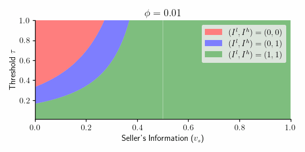

# Markets for Information
 
Python implemention of [Selling Information in Games with Externalities](https://arxiv.org/abs/2505.00405). 

If you find this useful in your work, we kindly request that you cite the following publication(s):

```
@misc{falconer2023bayesian,
      title={Bayesian Regression Markets}, 
      author={Thomas Falconer and Jalal Kazempour and Pierre Pinson},
      year={2023},
      eprint={2310.14992},
      archivePrefix={arXiv},
      primaryClass={cs.LG}
}
```

In this work, we:

* Model a competitive market as a game of incomplete information between two players.
* Consider a setting where one player observes a payoff-relevant state and can sell (possibly noisy) messages about it to the other player.
* Formulate the decision of what information to sell, and at what price, as a joint problem of [mechanism design](https://en.wikipedia.org/wiki/Mechanism_design) and [information design](https://en.wikipedia.org/wiki/Bayesian_persuasion).
* Characterize the profit-maximizing mechanism, where profit is defined as the payment received minus the informational externality, i.e., the cost of refining a competitor’s beliefs.


* Model a competitive market as game of incomplete information between two players.
* Consider one player observes some payoff-relevant state and can sell (possibly noisy)
messages thereof to the other.
* Frame the decision of what information to sell, and at what price, as a joint problem of [mechanism design](https://en.wikipedia.org/wiki/Mechanism_design) and [information design](https://en.wikipedia.org/wiki/Bayesian_persuasion).
* Characetize the mechanism that maximizes profit, which is  the payment minus the externality induced by selling information to a competitor, that is, the cost of refining a competitor’s beliefs.

As an example, in the case of congruent binary types (Section 4.1), information is sold only to the low type when the intensity of competition ($\tau$) is below the solid line, and only to the high type when $\tau$ is below the dashed line (see Figure 6).

<p align="center" width="100%">
    
</p>